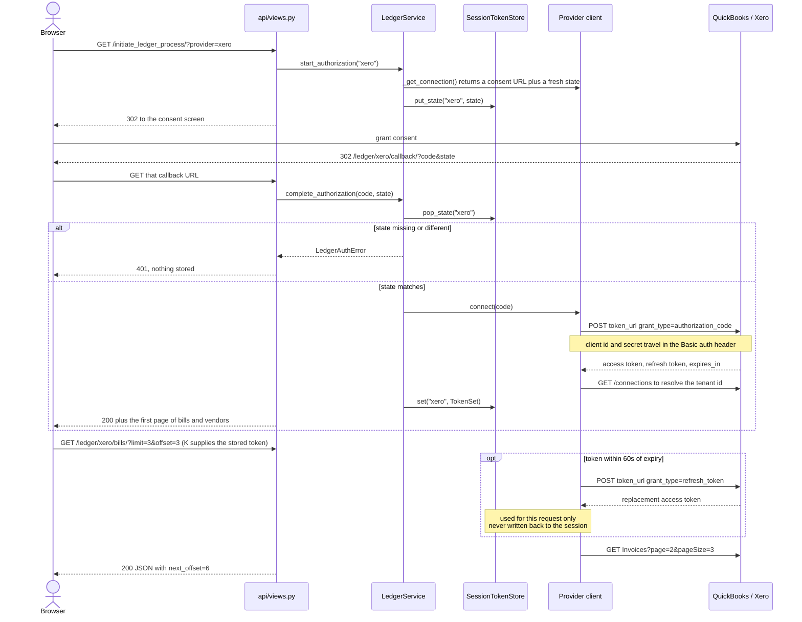

# Accounting Ledger Bridge

Reads a company's **bills and vendors** out of its accounting system and serves them as one
provider-neutral JSON API. QuickBooks Online and Xero sit behind the same four-method contract, so
a caller asks for `/ledger/quickbooks/bills/` or `/ledger/xero/bills/` and gets identically shaped
records back. Read-only on purpose: it reads payables, it never writes.

## What a caller gets back

Both providers normalise onto one record. Money is `Decimal`, parsed with `Decimal(str(value))` and
serialised as a string, never through `float` — a binary float cannot hold most two-decimal
amounts exactly. Collections page with an explicit cursor:

```
$ curl -s -b cookies.txt "$BASE/ledger/quickbooks/bills/?limit=3"
{
    "items": [
        {"provider": "quickbooks", "id": "141", "vendor_id": "56",
         "vendor_name": "Norton Lumber and Building Materials",
         "total": "1500.00", "balance": "1500.00", "currency": "USD",
         "document_number": "BILL-0141", "issued_on": "2024-03-01",
         "due_on": "2024-03-31", "is_paid": false}, ...],
    "offset": 0, "limit": 3, "next_offset": 3, "has_more": true
}
```

Rewrapped for width; the unwrapped bytes, a full OAuth round trip and every read endpoint are in
[`docs/transcripts/api-session.txt`](docs/transcripts/api-session.txt). Provider failures are typed
as `LedgerError` subclasses and mapped to HTTP in one table, `_STATUS_BY_ERROR` in `api/views.py`:
404 for a missing record or unknown provider, 401 for a rejected or absent token, 503 for missing
config, 502 for an unreachable provider.

## The OAuth round trip

The `state` parameter is minted when the authorization URL is built, parked in the session, and
consumed exactly once — replaying the same callback fails with a 401. Access tokens refresh lazily,
60 seconds ahead of the provider's stated expiry (`EXPIRY_SKEW_SECONDS`), so one cannot lapse
between our check and the provider's clock.



The callback returns only the *first* page of each collection, deliberately: a full sync inside
a callback would let a company with 20,000 bills turn a redirect into a multi-minute request.

## Running it

Python 3.11 or newer. No database server and no provider credentials are needed to boot it.

```bash
python -m venv .venv && source .venv/bin/activate
pip install -r requirements.txt
cp example.env .env   # then set DJANGO_SECRET_KEY in it to the output of:
python -c "from django.core.management.utils import get_random_secret_key as k; print(k())"
python manage.py migrate && python manage.py runserver 127.0.0.1:8870
```

To exercise the reads with no sandbox credentials, run the bundled stub. It mimics the QBO v3 URL
shapes, query language and response envelopes, and nothing under `api/` imports it:

```bash
python docs/local_provider_stub.py 8871   # in a second shell
QBOOK_CLIENT_ID=demo-client-id QBOOK_CLIENT_SECRET=demo-client-secret \
QBOOK_REDIRECT_URI=http://127.0.0.1:8870/accounts/quickbooks/login/callback/ \
QBOOK_API_BASE=http://127.0.0.1:8871/qbo QBOOK_TOKEN_URL=http://127.0.0.1:8871/oauth/token \
python manage.py runserver 127.0.0.1:8870
```

**Container:** the `Dockerfile` and `docker-compose.yml` are written but **not built or booted**
here — the project's own build report records `Build verified: NOT RUN — deferred, Docker off`, and
the same for boot. What *is* checked is that `docker compose config` renders
([transcript](docs/transcripts/docker-compose-config.txt)). As authored: two stages on
`python:3.12-slim`, non-root `ledger` user, gunicorn, SQLite on a volume, `/healthz` healthcheck.

## Endpoints

| Method | Path | Purpose |
| --- | --- | --- |
| `GET` | `/healthz` | Liveness. Never contacts a provider. |
| `GET` | `/ledger/providers/` | Registered providers, and whether this session connected each. |
| `GET` | `/initiate_ledger_process/?provider=` | Redirect to the consent screen. |
| `GET` | `/ledger/<provider>/callback/` | OAuth callback. QuickBooks also keeps its original `/accounts/quickbooks/login/callback/` path, so an existing Intuit app's registered redirect URI keeps working. |
| `GET` | `/ledger/<provider>/bills/?limit=&offset=&vendor_id=` | A page of bills. |
| `GET` | `/ledger/<provider>/bills/<id>/` | One bill. |
| `GET` | `/ledger/<provider>/vendors/?limit=&offset=` | A page of vendors. |
| `GET` | `/ledger/<provider>/vendors/<id>/` | One vendor. |

`limit` clamps to 1..100, and `vendor_id` is pushed into the provider's own query (`WHERE
VendorRef = '56'` for QuickBooks, a `Contact.ContactID` clause for Xero) rather than filtered
here. Xero pages by number, so an offset landing mid-page snaps back to that boundary.

## Credentials — bring your own

**Nothing here ships a usable credential**, and no provider credential is present in this
repository's git history. `example.env` is a blank template; fill in a copy at `.env`, which
`.gitignore` covers. `QBOOK_CLIENT_ID` / `QBOOK_CLIENT_SECRET` / `QBOOK_REDIRECT_URI` come from
your own app in the Intuit developer portal, `XERO_CLIENT_ID` / `XERO_CLIENT_SECRET` /
`XERO_REDIRECT_URI` from your own app at developer.xero.com, and each redirect URI must match the
one registered there. Generate `DJANGO_SECRET_KEY` yourself — a non-debug boot without one fails
with instructions rather than signing sessions with a public string.

Every value is read from the environment through `python-decouple`, none with a credential
default, and `OAuth2Credentials.require()` refuses to build a consent URL or touch a token
endpoint until `client_id`, `client_secret` and `redirect_uri` are all set, naming every
missing field at once. `example.env` documents the remaining knobs. `DEBUG` defaults to false and
`ALLOWED_HOSTS` is never `*`.

`api/tests/test_configuration.py` is the standing guard: it walks every tracked text file and
fails if any token hashes to one of a set of credential digests it carries — SHA-256 digests,
not values, so the check introduces nothing itself. If you ever commit a credential to a fork of
this tree, rotate it in the provider's portal; scrubbing a file does not un-disclose a secret.

## Tests, and what that actually proves

`DJANGO_DEBUG=true python manage.py test` reports **131 tests, 0 failures** (confirmed on
Python 3.12), `ruff check` is clean, and line coverage is 94% of 730 statements. The suite runs
with sockets blocked: `NoNetworkMixin` swaps
`socket.socket.connect` for a stub that fails the test, and providers are driven through a
`FakeTransport` that refuses any URL it was not given a route for, so a test reaching for Intuit
fails rather than quietly making a billable call — `NetworkGuardTests` asserts that guard bites.
Captured runs: [`test-run.txt`](docs/transcripts/test-run.txt) (suite and lint, per test),
[`coverage.txt`](docs/transcripts/coverage.txt) (by module),
[`python-versions.txt`](docs/transcripts/python-versions.txt) (3.11, 3.12, 3.13) and
[`deploy-check.txt`](docs/transcripts/deploy-check.txt) (`check --deploy`, plus the no-key boot
failure).

There is no vendor SDK in `requirements.txt` — four runtime packages, and the comment there
explains why: `python-quickbooks` pins `intuit-oauth==1.2.4`, which reaches the `imp` module
Python 3.12 removed.

## Adding a third ledger

`api/ledger/` is a plain Python library that imports no Django: the providers (`quickbooks.py`,
`xero.py`), the grant (`oauth.py`), the domain types (`domain.py`), the network seam
(`transport.py`) and the name-to-class map (`registry.py`) are testable on their own. Django
appears only in `api/services.py` and `api/views.py`.

Adding Sage or NetSuite is three steps: subclass `LedgerClientBase` and implement the four reads
plus `oauth_config()`, decorate it `@register`, add its credentials to `LEDGER_PROVIDERS` in
settings. Nothing existing changes — views and URL conf are already generic over `<provider>`,
and `build_client()` forwards only the config keys each provider's constructor declares, so
providers with different connection parameters share one settings shape.
`ContractConformanceTests` asserts every registered provider implements the contract. Providers
hold a `Transport` and never import `requests`, which buys the offline test guarantee and is where
network policy lives: one pooled session per process, a 15-second timeout, up to 3 retries with
0.5 backoff on 429/500/502/503/504.

## Known gaps

- **Tokens live in the browser session.** Django signs the session cookie but does not encrypt it,
  so a refresh token travels with the user. `TokenStore` is a protocol so a database-backed store
  is one class — that class has not been written.
- **A lazily refreshed token is not persisted.** `LedgerService.client()` rebuilds a client per
  call from the stored token and `store.set()` runs only in `complete_authorization()`, so a
  refresh during a read serves that one request and is discarded.
- **No authentication on the service itself.** Anyone who can reach it can start an OAuth flow.
- **Xero has never run against the live API.** Written to the published Accounting API 2.0
  contract and unit-tested against recorded shapes, but no Xero credentials were available end to
  end. QuickBooks was driven against the local stub, not Intuit's sandbox.
- **No caching and no background sync.** Every read is a live provider call, so paging 20,000 bills
  is 200 round trips. `iter_bills()` / `iter_vendors()` stream a collection behind a 100-page
  circuit breaker, but a deployment wants a task queue.
