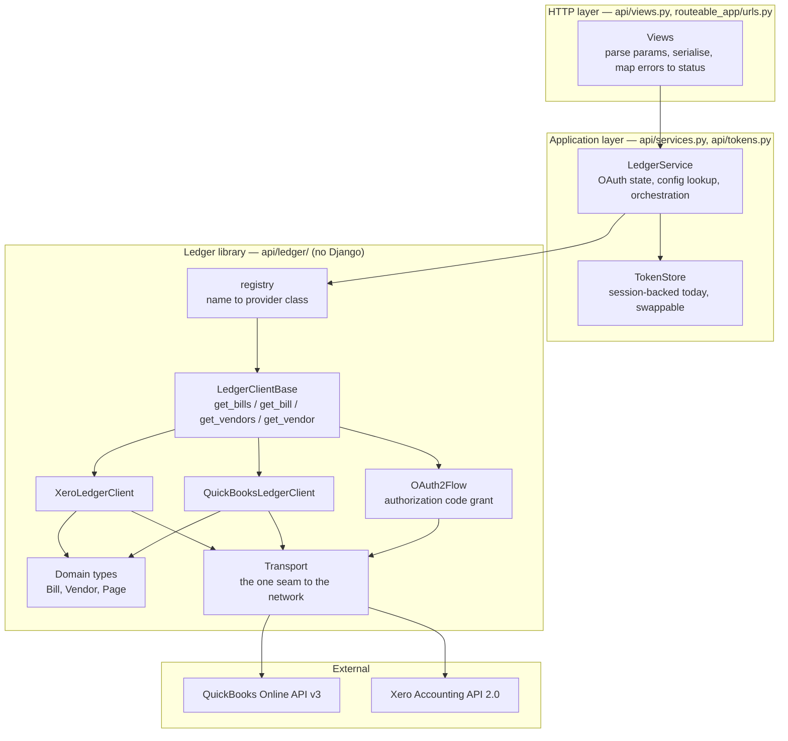
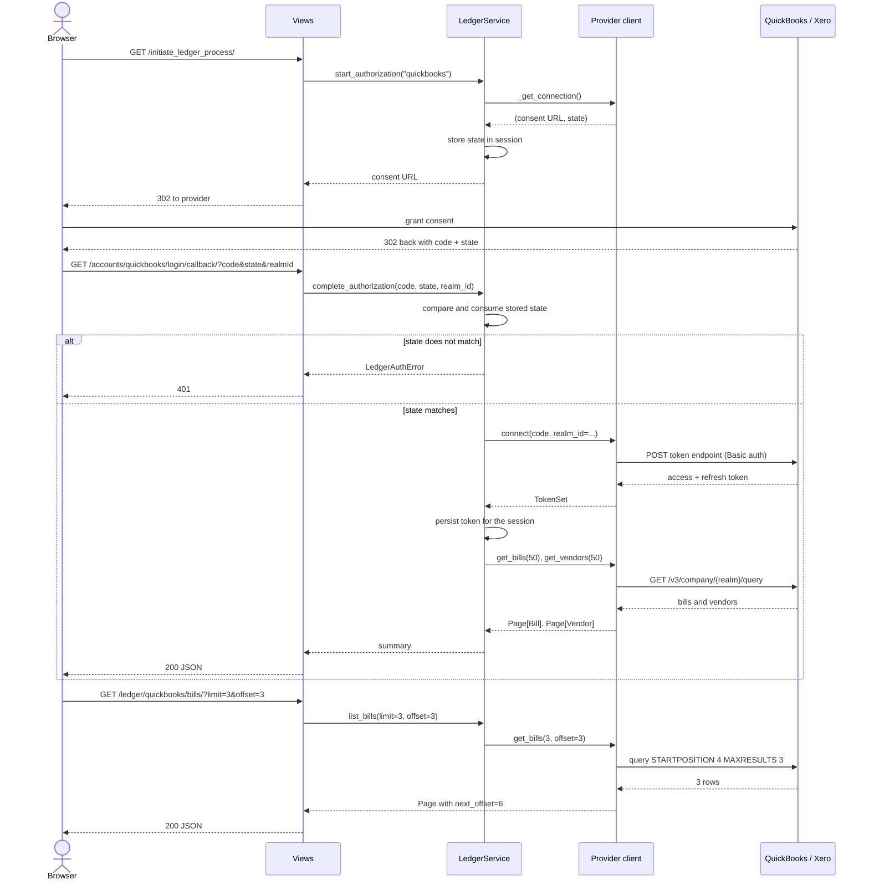

# Accounting Ledger Bridge

A small Django service that connects to a company's accounting ledger over OAuth 2.0 and
exposes its **bills** and **vendors** through one provider-neutral JSON API. QuickBooks
Online and Xero are both implemented behind the same interface, so a caller asks for
`/ledger/quickbooks/bills/` or `/ledger/xero/bills/` and gets back identically shaped
records.

It is read-only by design: it reads payables out of a ledger, it never writes to one.

---

## Captured output

Everything below is verbatim from a real run. The full transcripts live in
[`docs/transcripts/`](docs/transcripts/):

| File | What it is |
| --- | --- |
| [`api-session.txt`](docs/transcripts/api-session.txt) | A complete OAuth round trip and every read endpoint, captured with `curl` against the service on `127.0.0.1:8870` |
| [`test-run.txt`](docs/transcripts/test-run.txt) | `ruff check` and the full 131-test suite, per-test |
| [`coverage.txt`](docs/transcripts/coverage.txt) | Line coverage by module |
| [`deploy-check.txt`](docs/transcripts/deploy-check.txt) | `manage.py check --deploy` in production mode, and the boot guard when no signing key is set |
| [`python-versions.txt`](docs/transcripts/python-versions.txt) | The suite passing on Python 3.11, 3.12 and 3.13 |
| [`docker-compose-config.txt`](docs/transcripts/docker-compose-config.txt) | The rendered Compose configuration |

The service talks to Intuit and Xero over HTTPS, so the session was captured with
[`docs/local_provider_stub.py`](docs/local_provider_stub.py) standing in for the
QuickBooks Online API on port 8871 — same URL shapes, same query language, same response
envelopes. The stub is a development aid; nothing under `api/` imports it.

**Starting the OAuth flow.** Note the `state` parameter, which the original implementation
never sent:

```
$ curl -s -o /dev/null -D - -c cookies.txt $BASE/initiate_ledger_process/
HTTP/1.1 302 Found
Location: https://appcenter.intuit.com/connect/oauth2?client_id=demo-client-id&response_type=code&scope=com.intuit.quickbooks.accounting&redirect_uri=http%3A%2F%2F127.0.0.1%3A8870%2Faccounts%2Fquickbooks%2Flogin%2Fcallback%2F&state=nw60wpHIXIojn2mM7UQWczSKa98MG7G0
Set-Cookie:  sessionid=<redacted>; expires=Fri, 09 Oct 2026 19:21:06 GMT; HttpOnly; Max-Age=1209600; Path=/; SameSite=Lax
```

**A page of bills**, three at a time, with the cursor for the next page:

```
$ curl -s -b cookies.txt "$BASE/ledger/quickbooks/bills/?limit=3"
{
    "items": [
        {
            "provider": "quickbooks",
            "id": "141",
            "vendor_id": "56",
            "vendor_name": "Norton Lumber and Building Materials",
            "total": "1500.00",
            "balance": "1500.00",
            "currency": "USD",
            "document_number": "BILL-0141",
            "issued_on": "2024-03-01",
            "due_on": "2024-03-31",
            "is_paid": false
        },
        ...
    ],
    "offset": 0,
    "limit": 3,
    "next_offset": 3,
    "has_more": true
}
```

**Failures are typed and mapped to the right status**, rather than surfacing as a 500:

```
$ curl -s -w "\n<- HTTP %{http_code}\n" -b cookies.txt "$BASE/ledger/quickbooks/bills/999/"
{"error": "LedgerNotFound", "detail": "quickbooks get_bill(999): not found"}
<- HTTP 404

$ curl -s -w "\n<- HTTP %{http_code}\n" -b cookies.txt "$BASE/ledger/sage/bills/"
{"error": "UnknownProviderError", "detail": "ledger provider 'sage' is not configured; configured providers: quickbooks, xero"}
<- HTTP 404

$ curl -s -w "\n<- HTTP %{http_code}\n" -b cookies.txt "$BASE/ledger/xero/bills/"
{"error": "LedgerAuthError", "detail": "xero: client is not connected. Complete the OAuth callback, or construct the client with a stored token."}
<- HTTP 401
```

**The test suite**, run with sockets blocked:

```
$ DJANGO_DEBUG=true python manage.py test
Found 131 test(s).
System check identified no issues (0 silenced).
----------------------------------------------------------------------
Ran 131 tests in 0.082s

OK
```

---

## Architecture

Layered, with dependencies pointing inward. The `api/ledger/` package is a plain Python
library — it does not import Django — so every provider, the OAuth flow and the domain
types are testable on their own. Django appears only in the two outermost layers.



## Workflow

The OAuth round trip, then a read. The `state` parameter is generated when the
authorization URL is built, stored in the session, and consumed exactly once on the
callback.



---

## Quickstart

Python 3.11 or newer. No database server and no credentials are needed to boot it.

```bash
python -m venv .venv && source .venv/bin/activate
pip install -r requirements.txt

cp example.env .env
# Fill in DJANGO_SECRET_KEY and, when you have them, the provider credentials.
python -c "from django.core.management.utils import get_random_secret_key as k; print(k())"

python manage.py migrate
python manage.py runserver 127.0.0.1:8870

curl http://127.0.0.1:8870/healthz
```

To see the read endpoints working without sandbox credentials, run the local stub in a
second shell and point the QuickBooks provider at it:

```bash
python docs/local_provider_stub.py 8871

QBOOK_CLIENT_ID=demo-client-id \
QBOOK_CLIENT_SECRET=demo-client-secret \
QBOOK_REDIRECT_URI=http://127.0.0.1:8870/accounts/quickbooks/login/callback/ \
QBOOK_API_BASE=http://127.0.0.1:8871/qbo \
QBOOK_TOKEN_URL=http://127.0.0.1:8871/oauth/token \
python manage.py runserver 127.0.0.1:8870
```

### Endpoints

| Method | Path | Purpose |
| --- | --- | --- |
| `GET` | `/healthz` | Liveness. Never contacts a provider. |
| `GET` | `/ledger/providers/` | Registered providers and whether this session has connected each. |
| `GET` | `/initiate_ledger_process/?provider=` | Redirect to the provider's consent screen. |
| `GET` | `/accounts/quickbooks/login/callback/` | QuickBooks OAuth callback (kept at its original address). |
| `GET` | `/ledger/<provider>/callback/` | OAuth callback for any provider. |
| `GET` | `/ledger/<provider>/bills/?limit=&offset=&vendor_id=` | A page of bills. |
| `GET` | `/ledger/<provider>/bills/<id>/` | One bill. |
| `GET` | `/ledger/<provider>/vendors/?limit=&offset=` | A page of vendors. |
| `GET` | `/ledger/<provider>/vendors/<id>/` | One vendor. |

### Docker

Authored but **not yet built or booted** — the Docker daemon was unavailable in the
environment this was prepared in, so `docker build` and `docker compose up` have not been
run. `docker compose config` parses cleanly (see the transcript). The image is multi-stage,
runs as a non-root `ledger` user, mounts SQLite on a volume, and healthchecks `/healthz`.

```bash
docker compose config     # verified
docker compose up --build # NOT verified — see above
```

---

## Configuration

Every value is read from the environment via `python-decouple`; a `.env` file is picked up
automatically. Nothing is hard-coded.

| Variable | Required | Default | Purpose |
| --- | --- | --- | --- |
| `DJANGO_SECRET_KEY` | Yes, unless `DJANGO_DEBUG=true` | none — boot fails with instructions | Session and CSRF signing key. |
| `DJANGO_DEBUG` | No | `false` | Debug mode. Off by default; `true` relaxes `SECRET_KEY` and host checks for local work. |
| `DJANGO_ALLOWED_HOSTS` | Yes in production | `localhost,127.0.0.1,[::1]` when `DEBUG`, otherwise empty | Comma-separated hostnames. Never `*`. |
| `DJANGO_CSRF_TRUSTED_ORIGINS` | No | empty | Comma-separated origins for cross-origin POSTs. |
| `DJANGO_DB_PATH` | No | `<repo>/db.sqlite3` | SQLite file location. |
| `DJANGO_LOG_LEVEL` | No | `INFO` | Root log level. Forced to `CRITICAL` under `manage.py test`. |
| `DJANGO_SECURE_SSL_REDIRECT` | No | `true` when not `DEBUG` | Redirect HTTP to HTTPS. |
| `DJANGO_HSTS_SECONDS` | No | `31536000` when not `DEBUG` | HSTS max-age. |
| `DJANGO_HSTS_PRELOAD` | No | `false` | Opt in to the browser HSTS preload list. Off by default because preloading is effectively irreversible. |
| `LEDGER_DEFAULT_PROVIDER` | No | `quickbooks` | Provider used when a request omits one. |
| `LEDGER_HTTP_TIMEOUT` | No | `15` | Per-request timeout, in seconds, for provider calls. |
| `QBOOK_CLIENT_ID` | To use QuickBooks | empty | OAuth client id from the Intuit developer portal. |
| `QBOOK_CLIENT_SECRET` | To use QuickBooks | empty | OAuth client secret. |
| `QBOOK_REDIRECT_URI` | To use QuickBooks | empty | Must match the redirect URI registered with Intuit. |
| `QBOOK_ENVIRONMENT` | No | `sandbox` | `sandbox` or `production`; selects the API host. |
| `QBOOK_COMPANY_ID` | No | empty | Realm id. Captured automatically from the callback. |
| `QBOOK_API_BASE` | No | empty | Dev/proxy override for the API host. |
| `QBOOK_TOKEN_URL` | No | empty | Dev/proxy override for the token endpoint. |
| `XERO_CLIENT_ID` | To use Xero | empty | OAuth client id from the Xero developer portal. |
| `XERO_CLIENT_SECRET` | To use Xero | empty | OAuth client secret. |
| `XERO_REDIRECT_URI` | To use Xero | empty | Must match the redirect URI registered with Xero. |
| `XERO_TENANT_ID` | No | empty | Organisation id. Read from `/connections` after authorisation. |
| `XERO_API_BASE` | No | empty | Dev/proxy override for the API host. |
| `XERO_TOKEN_URL` | No | empty | Dev/proxy override for the token endpoint. |

---

## Development

```bash
pip install -r requirements-dev.txt

# Tests. DJANGO_DEBUG=true only supplies a throwaway SECRET_KEY.
DJANGO_DEBUG=true python manage.py test

# Lint. Configured in pyproject.toml; the tree is clean.
ruff check .
ruff check --fix .

# Coverage
DJANGO_DEBUG=true coverage run manage.py test && coverage report
```

The suite runs fully offline. `NoNetworkMixin` replaces `socket.socket.connect` with a
stub that fails the test, and providers are driven through a `FakeTransport` that records
every request and refuses any URL it was not given a route for. A test that tried to reach
a provider would fail, not quietly make a paid API call.

---

## Project structure

```
api/
  ledger/                 Framework-free library. No Django imports.
    base.py               LedgerClientBase — the four-operation contract
    domain.py             Bill, Vendor, Page; Decimal money, exact serialisation
    errors.py             LedgerError hierarchy
    oauth.py              OAuth 2.0 authorization-code grant, shared by providers
    quickbooks.py         QuickBooks Online v3
    registry.py           name -> provider class; the extension seam
    transport.py          Transport protocol + pooled, retrying requests session
    xero.py               Xero Accounting 2.0
  services.py             LedgerService — where Django and the library meet
  tokens.py               TokenStore protocol; session and in-memory stores
  views.py                Thin HTTP layer
  tests/                  131 tests: domain, oauth, both providers, registry, views
routeable_app/
  settings.py             Env-driven configuration and provider table
  urls.py                 Routes
docs/
  local_provider_stub.py  Stand-in QuickBooks API for local demos
  transcripts/            Captured output referenced above
```

---

## Design notes

**One contract, two providers.** The project began with a `LedgerClientBase` declaring
`get_bills(num, vendor_id)`, `get_bill(bill_id)`, `get_vendors(num)` and
`get_vendor(vendor_id)` — and one subclass that accepted every one of those arguments and
used none of them. `num` was ignored in favour of a hard-coded `max_results=50`,
`vendor_id` was never applied as a filter, and `get_bill`/`get_vendor` read hard-coded ids
(`1` and `56`) off the instance rather than the ones they were passed. The signatures are
unchanged; the arguments now do what they say. Results are returned rather than stashed on
instance attributes, which is what makes a client safe to reuse and each result
independently assertable.

`XERO_CLIENT_ID` and `XERO_CLIENT_SECRET` had been in `example.env` since the first commit
with no Xero code anywhere. The Xero provider is that missing half, and it is what turns
the abstract base from decoration into a real seam: both providers share one OAuth flow and
one transport, and differ only in URL shapes and field names.

**Dropping the vendor SDKs.** `python-quickbooks` pins `intuit-oauth==1.2.4`, which depends
on `future`, which imports the `imp` module Python 3.12 removed. The project was
permanently capped at Python 3.11 and would have grown less runnable over time. Worse,
`intuitlib.client.AuthClient.__init__` fetches Intuit's OpenID discovery document over
HTTPS — so *constructing* a client was a network call, on every request, and any unit test
that built one silently became an integration test. The four read operations and the
authorization-code grant are a few hundred lines of plain `requests` code, so they are
written directly here. The pinned dependency list went from 30 packages to 4, and the same
suite now passes on Python 3.11, 3.12 and 3.13 — see
[`python-versions.txt`](docs/transcripts/python-versions.txt).

**Money is `Decimal`, end to end.** Amounts are parsed with `Decimal(str(value))`, never
`float`, and serialised as strings padded to two places without ever rounding precision
away. Binary floats cannot represent most two-decimal amounts exactly; for an
accounts-payable bridge that is a correctness bug, not a rounding preference.

**Errors are typed and mapped once.** Every provider failure surfaces as a `LedgerError`
subclass, and `api/views.py` maps that hierarchy to a status code in exactly one place:
404 for a missing record or unknown provider, 401 for a rejected or absent token, 503 for
missing configuration, 502 for an unreachable provider. The original views caught
exceptions only to `raise e` again, so any provider hiccup was a 500 with a traceback.

**The transport is the only door to the network.** Providers hold a `Transport` and never
import `requests`. That is what gives the suite its offline guarantee, and it is where
timeouts, connection pooling and retry policy live — one pooled session for the whole
process rather than a fresh TLS handshake per call.

### Scalability

The honest bottleneck here is not CPU or the database — there are no models and no queries.
It is the number and size of outbound provider calls, and three things were wrong:

1. **No pagination.** `Bill.all(max_results=50)` fetched a fixed 50 and offered no way to
   ask for the rest. Every collection read now takes `limit` and `offset`, clamped to
   1..100, and returns a `next_offset` cursor. `iter_bills()` / `iter_vendors()` stream a
   whole collection, with a 100-page circuit breaker so a provider that keeps returning
   full pages cannot spin the loop forever.
2. **No server-side filtering.** Fetching every bill to find one vendor's is O(all bills).
   `vendor_id` is now pushed into the provider's own query (`WHERE VendorRef = '56'` for
   QuickBooks, a `Contact.ContactID` clause for Xero), so the filtering happens at the
   provider.
3. **A TLS handshake per call, and an unbounded one.** Each request built a fresh client
   and a fresh connection, with no timeout — a slow provider could pin a worker
   indefinitely. There is now one pooled `requests.Session` per process, with a 15-second
   default timeout and bounded retries with backoff on 429/5xx.

The callback deliberately returns only the *first* page of bills and vendors. A full sync
in an OAuth callback would let a company with 20,000 bills turn a redirect into a
multi-minute request. A real deployment would move a full sync to a task queue; that is a
seam this service leaves open rather than one it pretends to have.

### Extensibility

The one seam that matters is the provider registry. Adding Sage, NetSuite or FreeAgent is:

1. subclass `LedgerClientBase`, implement the four reads and `oauth_config()`;
2. `@register` it;
3. add its credentials to `LEDGER_PROVIDERS` in settings.

No existing module changes — not the service layer, not the views, not the URL conf, which
are already generic over `<provider>`. `build_client()` inspects each provider's
constructor and forwards only the config keys it declares, so providers with different
connection parameters share one settings shape. `ContractConformanceTests` asserts that
every registered provider actually implements the contract.

The second seam is `TokenStore`: token persistence is a protocol with a session-backed
implementation. Moving to encrypted database storage means writing one class.

### Security

- `DEBUG` defaults to **false** and `ALLOWED_HOSTS` is never `*`. Both were hard-coded the
  other way.
- The Django signing key was committed to the repository. It is now read from
  `DJANGO_SECRET_KEY`, and a non-debug boot without one fails immediately with instructions
  rather than signing sessions with a public string.
- `example.env` shipped real-looking QuickBooks and Xero OAuth client secrets. They have
  been removed and replaced with blanks; a test asserts none of them reappears in any
  tracked file. **If those apps are yours, rotate the credentials — they are still in the
  git history.**
- The OAuth flow now sends and verifies a single-use `state` parameter. Without it the
  callback accepted any code from anyone.
- Vendor ids are escaped before interpolation into QuickBooks' SQL-like query language.
- Session and CSRF cookies are `HttpOnly`, `SameSite=Lax`, and `Secure` outside debug;
  HSTS, `nosniff` and `X-Frame-Options: DENY` are on.

---

## Limitations

- **Read-only.** It reads bills and vendors. It does not create, pay or void anything.
- **Not yet built as a container.** The Dockerfile and Compose file are written to spec and
  `docker compose config` parses, but no image has been built and no container has been
  booted.
- **Tokens live in the session.** Django signs the session cookie but does not encrypt it,
  so this is right for a demo and wrong for production. `TokenStore` exists so that swap is
  one class; it has not been made.
- **No background sync.** Every read is a live call to the provider. There is no cache and
  no task queue, so a caller paging through 20,000 bills makes 200 provider calls.
- **Xero has not been exercised against the live API.** It is written to the published
  Accounting API 2.0 contract and fully unit-tested against recorded response shapes, but
  no Xero developer credentials were available to run it end to end. QuickBooks was driven
  end to end against a local stub, not against Intuit's sandbox.
- **No authentication on the service itself.** Anyone who can reach it can start an OAuth
  flow; a connected ledger is scoped to the browser session that authorised it. Putting
  this behind real authentication is a prerequisite for deploying it anywhere shared.
- **Xero paging is page-based.** Xero numbers pages rather than taking an offset, so an
  `offset` that falls mid-page is snapped back to that page's boundary. The response
  reports the offset actually used.
